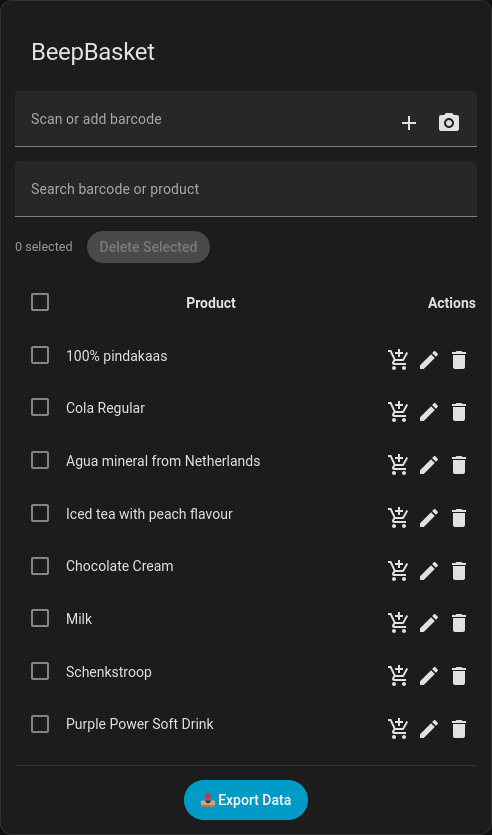
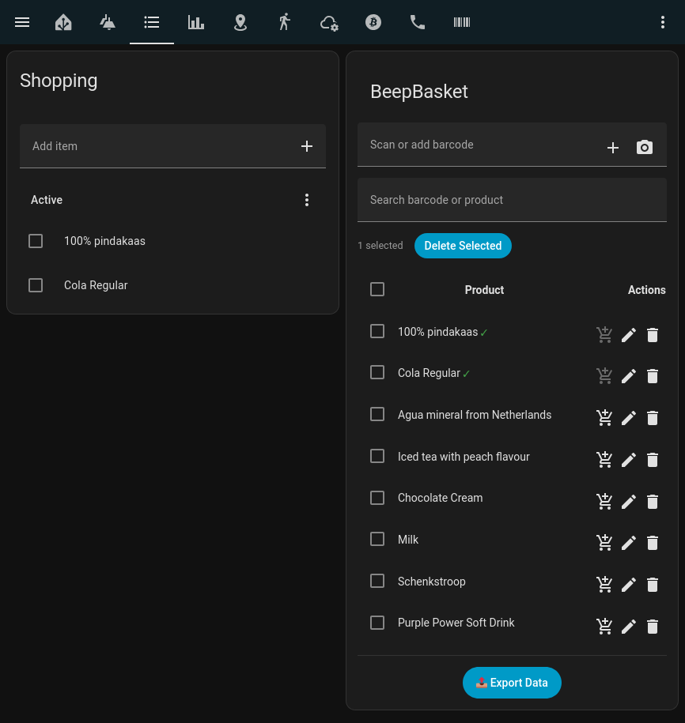
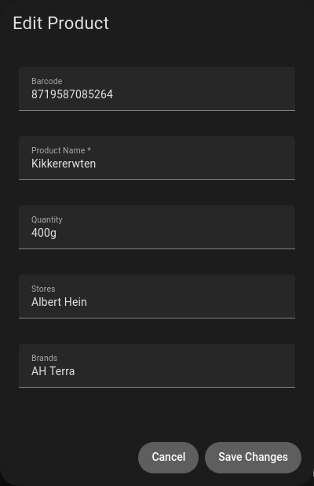
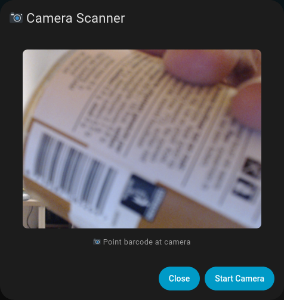

# BoopBasket

**Scan barcodes to track what's in your pantry.**

This is forked and (hopefully) improved version of [meijerwynand/beepbasket](https://github.com/meijerwynand/beepbasket). Thanks to him for the inspiration and base code.

## Features

- Tracks on-hand **stock** for anything you scan — a pantry/inventory monitor, not a shopping list
- Per-product **low-stock threshold**: once stock drops to or below it, the product is automatically added to a linked shopping list (if you've set one up) as a restock reminder — one-directional, it never reads the list back to change stock
- Scan with your phone/tablet camera to restock (+1), or use the +/- stepper right in the card's table to adjust stock manually (e.g. when you use something up)
- Linking a shopping list is entirely **optional** — it's only used for the low-stock reminder above
- Optional **stock-in / stock-out scanner entities** for a physical barcode scanner (e.g. a DIY/ESPHome device) — mount one near your pantry shelf to auto-restock, one near a bin to auto-decrement as you toss empty packaging, or neither. Configurable any time from the integration's **Configure** screen, not fixed at setup.
- OpenFoodFacts auto-lookup (name, brand, package size)
- Local product cache (JSON), no cloud dependency for your data
- Custom UI card (`boopbasket-card`), bundled and self-registered — no manual Lovelace resource needed
- Camera barcode scanning with automatic focus/zoom tuning; lens selection, manual zoom/focus, and debug info tucked into a collapsible section so the scanning view stays simple

## Installation & Usage

1. Install via HACS as a custom integration repository.
2. Settings → Devices & Services → Add Integration → **Boopbasket**. Linking a shopping list is optional here — it can be added, changed, or removed later via the integration's **Configure** (gear icon) screen, along with the optional stock-in/stock-out scanner entities.
3. The card is automatically available on every dashboard — just add it:

   ```yaml
   type: custom:boopbasket-card
   ```

   No manual "Add Resource" step required.

## Services

```bash
boopbasket.add_mapping     # add/update a barcode → product mapping, including its stock and low-stock threshold
boopbasket.adjust_stock    # increment/decrement a product's stock by a given amount
boopbasket.remove_mapping  # remove a barcode → product mapping
```

## Screenshots

*(from an earlier version of the card — the core flows below are unchanged, but field names/labels have since moved from "Quantity" to "Stock" plus a low-stock threshold)*

### Card

Simple interface



### Items added

Products already on your linked shopping list are checked directly in the BoopBasket table



### Edit added

Directly edit any mapping's details, stock, and low-stock threshold



### Camera support

Scan directly from your device to restock. You do need HTTPS for your camera to scan.



## External barcode scanner support

The example below shows an ESPHome config for a TTL barcode scanner (R35C-B with an ESP32-S2-mini) exposing scanned barcodes as a text sensor in Home Assistant. Point the integration's **stock-in** or **stock-out** entity (set from its Configure screen) at whichever entity you expose this way — e.g. mount it near the pantry shelf and assign it as stock-in to auto-restock, or near a bin and assign it as stock-out to auto-decrement as you toss empty packaging.

```yaml
logger:
  level: INFO  # Clean logs

uart:
  id: r35c
  tx_pin: GPIO17
  rx_pin: GPIO16
  baud_rate: 57600
  parity: NONE

# Global storage for HA
globals:
  - id: barcode_buffer
    type: std::string
    initial_value: '""'
  - id: last_scan_time
    type: uint32_t
    initial_value: '0'

interval:
  - interval: 500ms
    then:
      - lambda: |-
          static char buf[64];
          static int pos = 0;
          static uint32_t clear_time = 0;

          uint8_t byte;
          while (id(r35c).available()) {
            if (!id(r35c).read_byte(&byte)) break;

            if (byte == '\r' || byte == '\n') {
              if (pos > 0) {
                buf[pos] = '\0';
                if (millis() - id(last_scan_time) > 1000) {
                  id(barcode_buffer) = std::string(buf, pos);
                  id(scanner_barcode).publish_state(id(barcode_buffer));
                  ESP_LOGI("BARCODE", "Scanned: '%s'", buf);
                  id(last_scan_time) = millis();
                  clear_time = millis() + 3000;  // Clear in 3s
                }
                pos = 0;
              }
              break;
            }
            if (pos < 63) buf[pos++] = byte;
          }

          // Clear buffer after 3s delay
          if (clear_time > 0 && millis() > clear_time && id(barcode_buffer).length() > 0) {
            id(barcode_buffer) = "";
            id(scanner_barcode).publish_state("");
            clear_time = 0;
            ESP_LOGI("BARCODE", "Buffer cleared");
          }

text_sensor:
  - platform: template
    name: "Scanner Barcode"
    id: scanner_barcode
    lambda: |-
      return id(barcode_buffer);
    update_interval: never
```

## Project details

https://hackaday.io/project/204783-beepbasket

## Credits

- Forked from [meijerwynand/beepbasket](https://github.com/meijerwynand/beepbasket)
- https://github.com/zxing/zxing for the Camera barcode scanner library
